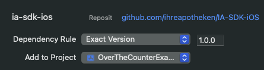
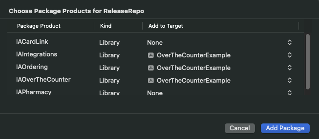

IA SDK is iOS SDK that helps integrate IhreApotheken into your app by providing plug-and-play UI and communication with backend services.

The SDK consists of the following swift packages:
* **IAIntegrations**: Legal, onboarding, start screen, Apofinder (pharmacy search with list and map).
* **IAOverTheCounter**: Product search, product details, inquiry.
* **IAOrdering**: Cart, checkout, payment.
* **IAPharmacy**: Pharmacy details.
* **IAPrescription**: Prescription scanner.
* **IACardLink**: Scanning prescriptions from electornic health cards.

To use IA SDK, you will need an API key and Client ID. The API key is bound to specific app Bundle ID(s) and comes with a set of entitlements. Each entitlement enables access to certain features or services within the SDK.

IA SDK is developed in Swift/SwiftUI.

# Requirements

* iOS 15 or above
* API key
* Client ID


# Installation

To add the IA SDK to your Xcode project, follow these steps:

1.  Open your Xcode `project` or `workspace`, then go to **File > Add Package Dependencies**…
    
2.  In the **Search or Enter Package URL** field, enter [https://github.com/ihreapotheken/IA-SDK-iOS](https://github.com/ihreapotheken/IA-SDK-iOS).
    
3.  Specify the version you want to use and click **Add Package**. We recommend selecting **Exact Version** at this time.  
    
    
4.  Choose the package products you need, assign them to your app target, and click **Add Package**.
    
    > ⚠️ You need to select only package products that you will use and for which your API key has entitlements.

    

# Project setup
1. If you are using apofinder then you need to add **NSLocationWhenInUseUsageDescription** key to your Info.plist.
2. If you are using CardLink then please read [IACardlink](./docs/IACardLink.md)

# Usage
1. **Set bundle identifier**  
You need to set your bundle identifier in the target’s Build Settings, as the API key is linked specifically to that identifier.

2. **Import the required products**  
Then you need to import the modules that you will be using. `IACore` and `IAIntegrations` are mandatory, others are optional. In this example we will be using product search from `IAOverTheCounter` and cart from `IAOrdering`.
```swift
import IACore
import IAIntegrations
import IAOverTheCounter
import IAOrdering
```

3. **Register modules and basic setup**  
Next, you need to enter you API key and client ID. 
Then call the `register()` method for each product you plan to use. This step is required because products can be interconnected. For example, registering `ordering` makes the **Cart** feature (from `IAOrdering`) internally available to the **Product Search** feature (from `IAOverTheCounter`), enabling features like a cart button on the search screen.
```swift
IASDK.configuration.apiKey = "ENTER YOUR API KEY HERE"
IASDK.configuration.clientID = "ENTER YOUR CLIENT ID HERE"
    
IASDK.register([
    .integrations, 
    .overTheCounter,
    .ordering,
    .apofinder
])
```
> [!IMPORTANT]
> Don't forget to set your API key and client ID.

4. **Initialize**  
Before using any SDK features, you must ensure that required conditions are met. Call the `initialize` function once your UI is ready. If you call this at start of the app or if you have a single entry point from where you present IA SDK, you can set *isCancellable* to false and user won't be able to pass the prerequisites UI.
```
let options = IASDKInitializationOptions(
    prerequisitesOptions: .init(
        shouldShowIndicator: true, 
        isCancellable: false, 
        isAnimated: true, 
        shouldRunLegal: true, 
        shouldRunOnboarding: true, 
        shouldRunApofinder: true
    )
)
let result = try await IASDK.initialize(options: options)
navigationPath.append(.iaStartScreen)
```

> [!IMPORTANT]
> If you set *isCancellable* to true then prerequisites flow can be cancelled, in that case you must check result before using SDK, as shown in example below.
> If you set it to false, then you don't need to check result because user won't be able to go past prerequisites UI (unless you have multiple entry points).
```
let result = try await IASDK.initialize(options: options)
if result.prerequisitesResult.didAgreeToLegalNotice, result.prerequisitesResult.pharmacyID != nil {
    navigationPath.append(.iaStartScreen)
} else {
    errorMessage = "Initialization failed..."
}   
```

Calling *initialize* will do the following:
* Validate your API key
* Fetch remote configuration (your legal data, feature flags, remote colors etc.)
* Present prerequisites flow: 
    *   **Legal Opt-In (mandatory):** The user must opt in to use the SDK. This is presented first time and when version of some legal document changes.
    
    *   **Onboarding (optional):** An introductory onboarding screen, shown only once.
    
    *   **Apofinder (mandatory):** All products require a pharmacy to be set. You can either:
    
        *   Manually provide a pharmacy identifier to the IA SDK, or
        
        *   Let Prerequisites present **Apofinder**. This will allow user to select pharmacy from list or map.

To skip certain steps, see [Initialization](./docs/Initialization.md).

# Features
[All modules and features](./docs/FeatureOverview.md)  
[Initialization](./docs/Initialization.md)  
[IAIntegrations](./docs/IAIntegrations.md)  
[IAOverTheCounter](./docs/IAOverTheCounter.md)  
[IAOrdering](./docs/IAOrdering.md)  
[IAPharmacy](./docs/IAPharmacy.md)  
[IAPrescription](./docs/IAPrescription.md)
[IACardlink](./docs/IACardLink.md)
[Presentation](./docs/Presentation.md)

# Full example code
This is full code for example app that has product search on one tab and cart on another. These two features will internally communicate, e.g. when you add some product from search or any other screen, it will be added to cart.

```swift
import SwiftUI
import IACore
import IAIntegrations
import IAOverTheCounter
import IAOrdering
import IAPrescription

@main
struct MainExampleApp: App {
    @StateObject private var viewModel = ExampleAppViewModel()
    
    var body: some Scene {
        WindowGroup {
            if viewModel.isLoaded {
                TabView {   
                    IAProductSearchScreen()
                        .tabItem { Text("Search") }
                    
                    IACartScreen()
                        .tabItem { Text("Cart") }
                }
            } else {
                if let errorMessage = viewModel.errorMessage {
                    Text(errorMessage)
                        .foregroundStyle(.red)
                }
            }
        }
    }
}

@MainActor
final class ExampleAppViewModel: ObservableObject {
    @Published var isLoaded = false
    @Published var errorMessage: String?
    
    
    init() {
        IASDK.configuration.apiKey = "ENTER YOUR API KEY HERE"
        IASDK.configuration.clientID = "ENTER YOUR CLIENT ID HERE"
        
        IASDK.register([
            .integrations, 
            .overTheCounter,
            .ordering,
            .apofinder,
            .prescription
        ])
        
        Task {
            await initializeSDK()
        }
    }
    
    func initializeSDK() async {
        do {
            let options = IASDKInitializationOptions(
                prerequisitesOptions: .init(
                    shouldShowIndicator: true, 
                    isCancellable: false, 
                    isAnimated: true, 
                    shouldRunLegal: true, 
                    shouldRunOnboarding: true, 
                    shouldRunApofinder: true
                )
            )
            let result = try await IASDK.initialize(options: options)
            isLoaded = true // We don't have to check result because isCancellable is false, otherwise you need to check result.didAgreeToLegalNotice and result.pharmacyID
        } catch {
            errorMessage = "Error\n\(error)"
        }
    }
}
```
