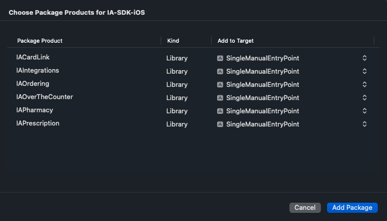

IA SDK is iOS SDK that helps integrate IhreApotheken into your app by providing plug-and-play UI and communication with backend services.

The SDK consists of the following swift packages:
* **IAIntegrations**: Legal, onboarding, start screen etc.
* **IAOverTheCounter**: Product search, product details, inquiry
* **IAOrdering**: Cart, checkout, payment
* **IAPharmacy**: Pharmacy details, ApoFinder (pharmacy search with list and map)
* **IAScanner**: Prescription scanner

To use IA SDK, you will need an API key and Client ID. The API key is bound to specific app Bundle ID(s) and comes with a set of entitlements. Each entitlement enables access to certain features or services within the SDK.

IA SDK is developed in Swift/SwiftUI.

# Requirements

* iOS 15 or above
* API key
* Client ID


# Installation

To add the IA SDK to your Xcode project, follow these steps:

1.  Open your Xcode `project` or `workspace`, then go to **File > Add Package Dependencies**…
    
2.  In the **Search or Enter Package URL** field, enter [https://github.com/ihreapotheken/IA-SDK-iOS](https://github.com/ihreapotheken/IA-SDK-iOS).
    
3.  Specify the version you want to use and click **Add Package**. We recommend selecting **Exact Version** at this time.  
    
    
4.  Choose the package products you need, assign them to your app target, and click **Add Package**.
    
    > ⚠️ You need to select only package products that you will use and for which your API key has entitlements.

    
    

# Usage
1. **Import the required products**  
`IAOverTheCounter` is imported because we want **Product Search** feature in our example app. `IAOrdering` is imported because we want **Cart** feature. `IACore` is always needed. `IAIntegrations` is needed to handle prerequisites (legal, onboarding). We won't use other packages in this example.

```swift
import IACore
import IAIntegrations
import IAOverTheCounter
import IAOrdering
```

2. **Setup and register**  
First you need to enter you API key and client ID. 
Next, call the `register()` method for each product you plan to use. This step is required because products can be interconnected. For example, calling `IAOrderingSDK.register()` makes the **Cart** feature (from `IAOrdering`) internally available to the **Product Search** feature (from `IAOverTheCounter`), enabling features like a cart button on the search screen.
```swift
IASDK.configuration.apiKey = "ENTER YOUR API KEY HERE"
IASDK.configuration.clientID = "ENTER YOUR CLIENT ID HERE"
IASDK.delegate = delegate
    
IAIntegrationsSDK.register()
IAOverTheCounterSDK.register()
IAOrderingSDK.register(delegate: delegate)
```
3. **Initialize**  
Before using any SDK features, you must ensure that required conditions are met. Call the following line once your UI is ready:
```
let result = try await IASDK.initialize(options: .init(shouldShowIndicator: true, isCancellable: false, isAnimated: false))
```
This will:
* Validate your API key
* Fetch remote configuration (your legal data, feature flags, remote colors etc.)
* Present prerequisites flow: 
    *   **Legal Opt-In (mandatory):** The user must opt in to use the SDK.
    
    *   **Onboarding (optional):** An introductory onboarding screen shown only once.
    
    *   **Pharmacy (mandatory):** All products require a pharmacy to be set. You can either:
    
        *   Manually provide a pharmacy identifier to the IA SDK, or
        
        *   If you’re using the **IAPharmacy** product, allow users to search for pharmacies via the **ApoFinder** feature (not yet available).

To skip certain steps, see [Prerequisites](./docs/Prerequisites.md).

# Features

[Prerequisites](./docs/Prerequisites.md)  

[IAOverTheCounter](./docs/IAOverTheCounter.md)  

[IAOrdering](./docs/IAOrdering.md)  

[Style Configuration](./docs/StyleConfiguration.md)  

[Presentation](./docs/Presentation.md)


# Full example code
This is full code for example app that has **Product Search** feature on one tab and **Cart** feature on another. These two features will internally communicate, e.g. when you add some product from search or any other screen, it will be added to cart.

```swift
import SwiftUI
import IACore
import IAIntegrations
import IAOverTheCounter
import IAOrdering

@main
struct MainExampleApp: App {
    @StateObject private var viewModel = ExampleAppViewModel()
        
    var body: some Scene {
        WindowGroup {
            if viewModel.isLoaded {
                TabView {   
                    IAProductSearchScreen()
                        .tabItem { Text("Search") }
                    
                    IACartScreen()
                        .tabItem { Text("Cart") }
                }
            } else {
                if let errorMessage = viewModel.errorMessage {
                    Text(errorMessage)
                        .foregroundStyle(.red)
                }
            }
        }
    }
}

@MainActor
final class ExampleAppViewModel: ObservableObject {
    @Published var isLoaded = false
    @Published var errorMessage: String?

    private let delegate = IASDKDelegate()
    
    init() {
        IASDK.configuration.apiKey = "ENTER YOUR API KEY HERE"
        IASDK.configuration.clientID = "ENTER YOUR CLIENT ID HERE"
        IASDK.delegate = delegate
        
        IAIntegrationsSDK.register()
        IAOverTheCounterSDK.register()
        IAOrderingSDK.register(delegate: delegate)
        
        Task {
            await initializeSDK()
        }
    }
    
    func initializeSDK() async {
        do {
            let result = try await IASDK.initialize(options: .init(shouldShowIndicator: true, isCancellable: false, isAnimated: false))
            isLoaded = true // We don't have to check result because isCancellable is true, otherwise you need to check result.didAgreeToLegalNotice and result.pharmacyID
        } catch {
            errorMessage = "Error\n\(error)"
        }
    }
}
```
